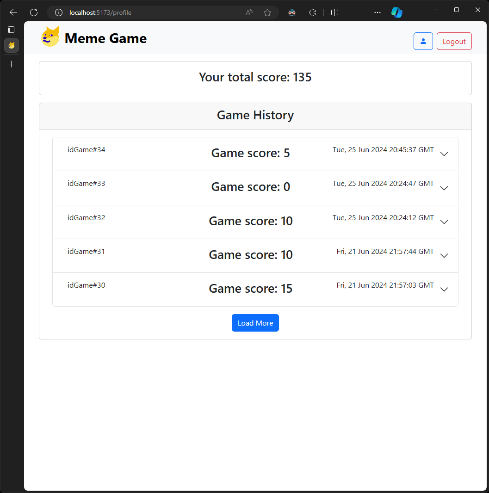

# Exam #1: "Meme Game"

- [Exam #1: "Meme Game"](#exam-1-meme-game)
  - [Student: s332100 OCCHIPINTI EDUARD ANTONOVIC](#student-s332100-occhipinti-eduard-antonovic)
  - [React Client Application Routes](#react-client-application-routes)
  - [Main React Components](#main-react-components)
  - [API Server](#api-server)
  - [Database Tables](#database-tables)
    - [Short overview](#short-overview)
    - [Tables (7)](#tables-7)
      - [CorrectCaption](#correctcaption)
      - [Caption](#caption)
      - [Round](#round)
      - [Meme](#meme)
      - [Game](#game)
      - [User](#user)
    - [Triggers (2)](#triggers-2)
      - [Round.AfterInsert](#roundafterinsert)
      - [Game.BeforeDelete](#gamebeforedelete)
  - [Screenshots](#screenshots)
  - [Users Credentials](#users-credentials)

## Student: s332100 OCCHIPINTI EDUARD ANTONOVIC

## React Client Application Routes

- Route `/`: home page, also contains the play button to start the new game
- Route `/play`: page where the game is played
- Route `/profile`: page showing the history of the games played by the user

## Main React Components

- `Profile` (in `components/user/Profile.jsx`): component used to render the profile of the user, consisting of the game history and the total score
- `Game` (in `components/game/Game.jsx`): component used to render the game, consisting of the meme, the correct caption and the incorrect captions
- `Round` (in `components/game/Round.jsx`): where all the game logic actually takes place
- `CustomNavbar.jsx` (in `components/CustomNavbar.jsx`): component used to render the navigation bar which includes the login/logout button, the profile button (if logged in) and the home button
- `MemeCard` (in `components/MemeCard.jsx`): component used to render a meme with an associated caption and give it an appropriate background based on the correctness of the caption, is reused both to show the end game screen and to show the history
- `App` (in `App.jsx`): main component of the application, contains the routing logic and the state of the user

## API Server

- POST `/api/sessions`: login
  - request body content: `{ email: string, password: string }`
  - response body content: `{ id: number, name: string, surname: string, email: string, totalScore: number }`
  - response status code: 200
  - possible errors: 401 (Unauthorized), 422 (Unprocessable Entity)
- DELETE `/api/sessions/current`: logout
  - response status code: 200
- GET `/api/sessions/current`: get current user
  - response body content: `{ id: number, name: string, surname: string, email: string, totalScore: number }`
  - response status code: 204
  - possible errors: 401 (Unauthorized), 500 (Internal Server Error)
- GET `/api/games?limit=&offset=`: get the list of games
  - request query parameters: `limit` (number of games to retrieve), `offset` (number of games to skip)
  - response status code: 200
  - possible errors: 500 (Internal Server Error)
- POST `/api/games`: create a new game
  - request body content: `{ rounds: [ { idMeme: number, idCaption?: number, score: number } ] }`
  - response status code: 201
  - possible errors: 500 (Internal Server Error), 422 (Unprocessable Entity)
- GET `/api/memes/random`: get a random meme
  - response body content: `{ id: number, tag: string }`
  - response status code: 200
  - possible errors: 500 (Internal Server Error)
- GET `/api/memes/:id/captions/correct?count=`: get the correct caption of a meme
  - request query parameters: `count` (number of captions to retrieve)
  - request parameters: `id` (meme id)
  - response body content: `{ id: number, caption: string }`
  - response status code: 200
  - possible errors: 500 (Internal Server Error)
- GET `/api/memes/:id/captions/incorrect?count=`: get the incorrect captions of a meme
  - request query parameters: `count` (number of captions to retrieve)
  - request parameters: `id` (meme id)
  - response body content: `[ { id: number, caption: string } ]`
  - response status code: 200
  - possible errors: 500 (Internal Server Error)

## Database Tables

### Short overview

- Table `User` - contains information about the users and their total score over all games
- Table `Game` - contains information about the games played by the users
- Table `Round` - contains information about the rounds associated with each game
- Table `Meme` - contains the tag of the memes
- Table `Caption` - contains the captions of the memes
- Table `CorrectCaption` - contains the association between the memes and the correct captions

### Tables (7)

#### CorrectCaption

```sql
CREATE TABLE IF NOT EXISTS "CorrectCaption" (
	"id" INTEGER NOT NULL,
	"idCaption" INTEGER NOT NULL,
	"idMeme" INTEGER NOT NULL,
	PRIMARY KEY("id" AUTOINCREMENT),
	FOREIGN KEY("idMeme") REFERENCES "Meme"("id"),
	FOREIGN KEY("idCaption") REFERENCES "Caption"("id")
);
```

#### Caption

```sql
CREATE TABLE IF NOT EXISTS "Caption" (
	"id" INTEGER NOT NULL,
	"caption" TEXT NOT NULL UNIQUE,
	PRIMARY KEY("id" AUTOINCREMENT)
);
```

#### Round

```sql
CREATE TABLE IF NOT EXISTS "Round" (
	"id" INTEGER NOT NULL,
	"idGame" INTEGER NOT NULL,
	"idMeme" INTEGER,
	"idCaption" INTEGER,
	"score" INTEGER NOT NULL DEFAULT 0,
	PRIMARY KEY("id" AUTOINCREMENT),
	FOREIGN KEY("idMeme") REFERENCES "Meme"("id") ON DELETE
	SET
		NULL,
		FOREIGN KEY("idCaption") REFERENCES "Caption"("id") ON DELETE
	SET
		NULL,
		FOREIGN KEY("idGame") REFERENCES "Game"("id") ON DELETE CASCADE
);
```

#### Meme

```sql
CREATE TABLE IF NOT EXISTS "Meme" (
	"id" INTEGER NOT NULL,
	"tag" TEXT NOT NULL,
	PRIMARY KEY("id" AUTOINCREMENT)
);
```

#### Game

```sql
CREATE TABLE IF NOT EXISTS "Game" (
	"id" INTEGER NOT NULL,
	"idUser" INTEGER NOT NULL,
	"date" TEXT NOT NULL,
	PRIMARY KEY("id" AUTOINCREMENT),
	FOREIGN KEY("idUser") REFERENCES "User"("id") ON DELETE CASCADE
);
```

#### User

```sql
-- Business rule: id=0 is not valid, (I want to avoid the check at every insert)
CREATE TABLE IF NOT EXISTS "User" (
	"id" INTEGER NOT NULL,
	"email" TEXT NOT NULL UNIQUE,
	"name" TEXT NOT NULL,
	"surname" TEXT NOT NULL,
	"hash" TEXT NOT NULL,
	"salt" TEXT NOT NULL,
	"totalScore" INTEGER DEFAULT 0,
	PRIMARY KEY("id" AUTOINCREMENT)
);
```

### Triggers (2)

#### Round.AfterInsert

```sql
CREATE TRIGGER AfterInsert
AFTER
INSERT
	ON Round BEGIN
UPDATE
	User
SET
	totalScore = totalScore + NEW.score
WHERE
	User.id = (
		SELECT
			idUser
		FROM
			Game
		WHERE
			id = NEW.idGame
	);

END;
```

#### Game.BeforeDelete

```sql
CREATE TRIGGER BeforeDelete BEFORE DELETE ON Game BEGIN
UPDATE
	User
SET
	totalScore = totalScore - (
		SELECT
			SUM(score)
		FROM
			Round
		WHERE
			idGame = OLD.id
	)
WHERE
	User.id = OLD.idUser;

END;
```

## Screenshots





## Users Credentials

| **Email**                            | **Password** |
| ------------------------------------ | ------------ |
| eduard.occhipinti@studenti.polito.it | funghi       |
| miriam.lamari@studenti.polito.it     | gelato       |
